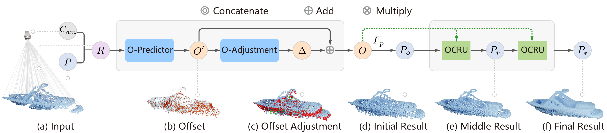

# Shape Completion with Points in the Shadow

[Bowen Zhang](https://realityanddreams.github.io/), [Xi Zhao](https://xiaoppx.github.io/home.html), [He Wang](http://drhewang.com/), [Ruizhen Hu](https://csse.szu.edu.cn/staff/ruizhenhu/index.htm)

-----
This repository contains the source code for the paper [Shape Completion with Points in the Shadow](https://arxiv.org/abs/2209.08345), The project page is [here](https://zhangbowen-wx.github.io/projects/SCPS/SCPS.html).


[](fig/overview.png)


## Datasets
We use the Multi-View Partial point cloud dataset (MVP) in our experiments. As there is no camera configuration in the origin MVP dataset, we recompute the MVP dataset to record the camera configuration. The dataset we use can be avaliable [here](https://drive.google.com/drive/folders/1D8FGtYZooPsgbb0j-bnuEBppR-MHm-m1).

The pretrained models of our method are avaliable as follows:
- [pretrained_model(with GT viewpoint)](https://drive.google.com/drive/folders/1CTS38m4wCmJr2Nnbxuz3foTmngZKDxbh)
- [pretrained_model(without GT viewpoints)](https://drive.google.com/drive/folders/1vGDKk7QjqtIM1QmhKNoo0R5bQrz0rKA7)

#### Install Python Dependencies
```
cd Shape-Completion-with-Points-in-the-Shadow
pip install -r requirements.txt
```

#### Build Pytorch Extensions
```
cd utils/ChamferDistancePytorch/chamfer3D
python setup.py install

cd ../../../

cd utils/pointnet2_ops_lib
python setup.py install
```

## Getting Started
To train our models, you can use following commands:
```
python train.py # train our model(with GT viewpoints)
python train_VP.py # train our model(without GT viewpoints)
```
The trained model parameters will be placed in the log/model/ folder.

To test our models, you can use following commands:
```
python test.py # test our model(with GT viewpoints)
python test_VP.py # test our model(without GT viewpoints)
```

## License

This project is open sourced under MIT license.

